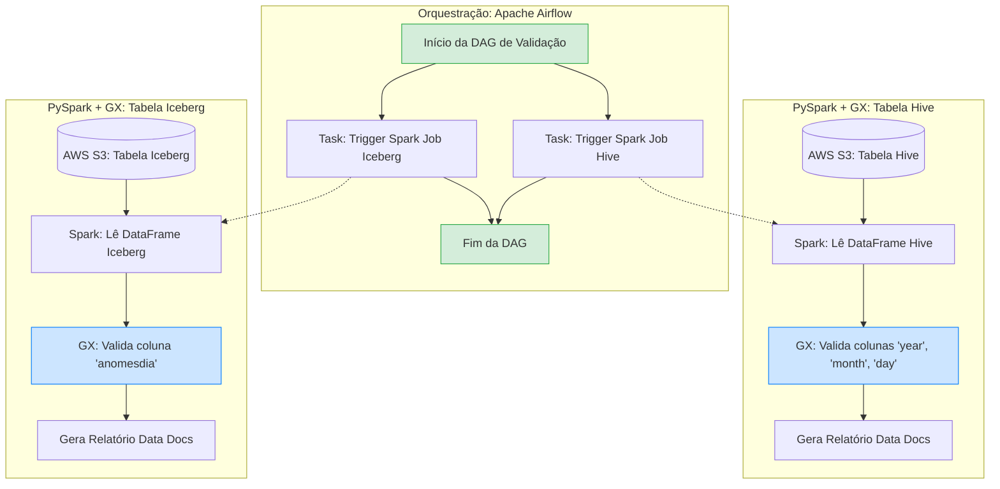

# Projeto de Validação de Particionamento (Hive e Iceberg) com Great Expectations e Airflow

Este documento define o plano para a criação de um laboratório de testes focado em validar o particionamento de duas tabelas "System of Truth" (SOTs) armazenadas no AWS S3. Uma tabela utiliza o formato Iceberg e a outra utiliza o formato Hive. A orquestração será feita pelo Apache Airflow e o processamento de dados/validação utilizará PySpark em conjunto com o Great Expectations (GX).

## Visão Geral da Solução

O objetivo principal é garantir que as tabelas estejam particionadas corretamente conforme o esperado, dada a diferença na forma como o Hive e o Iceberg lidam com partições:
- **Hive:** O particionamento é explícito e baseado em diretórios (ex: `s3://bucket/table/year=2023/month=10/`).
- **Iceberg:** O particionamento é "escondido" (hidden partitioning) e gerenciado através de arquivos de metadados, o que evita a necessidade de declarar colunas de partição extras e permite a evolução das partições sem quebrar queries.

Para validar isso, usaremos o **PySpark** para interagir com o S3/Iceberg/Hive e o **Great Expectations** para rodar as regras de validação (Expectations) em cima dos DataFrames gerados pelo Spark. O **Airflow** será responsável por disparar esses jobs.

## Estrutura do Projeto

A estrutura de diretórios proposta para o repositório (`gx_teste`) é:

```text
gx_teste/
├── dags/
│   └── partition_validation_dag.py        # DAG do Airflow para orquestrar as validações
├── spark_scripts/
│   ├── validate_hive_sot.py               # Job PySpark para validar tabela Hive
│   └── validate_iceberg_sot.py            # Job PySpark para validar tabela Iceberg
├── great_expectations/                    # Configurações do projeto GX
│   ├── expectations/
│   │   ├── hive_partition_suite.json      # Regras (Expectations) para o Hive
│   │   └── iceberg_partition_suite.json   # Regras (Expectations) para o Iceberg
│   └── great_expectations.yml             # Arquivo principal de configuração do GX
├── docker-compose.yml                     # (Opcional) Ambiente local com Airflow+Spark
└── requirements.txt                       # Dependências Python (great-expectations, pyspark, apache-airflow)
```

## Scripts PySpark (`spark_scripts/`)

Os scripts PySpark serão responsáveis por iniciar a sessão do Spark (com os pacotes necessários do Iceberg e AWS S3), instanciar o contexto do Great Expectations e rodar a validação.

### `validate_hive_sot.py`
Neste script, leremos a tabela Hive do S3. A validação de partição do Hive será focada em garantir que as colunas de partição (`year`, `month`, `day`) existam, não sejam nulas e contenham valores válidos dentro do padrão esperado. O Great Expectations aplicará regras (ex: `expect_column_values_to_not_be_null`, `expect_column_values_to_be_between`) nessas colunas específicas.

### `validate_iceberg_sot.py`
Para a tabela Iceberg, a validação de partição focará na coluna `anomesdia`. O script usará o PySpark para ler a tabela Iceberg e passará os dados para o Great Expectations validar se a coluna `anomesdia` atende aos critérios esperados de formato e preenchimento (ex: `expect_column_values_to_match_regex` para validar o formato YYYYMMDD). Opcionalmente, podemos validar também a tabela de metadados de partição do Iceberg (`.partitions`).

## DAGs do Airflow (`dags/`)

### `partition_validation_dag.py`
Criaremos uma DAG com duas tarefas principais rodando em paralelo ou sequencialmente. Utilizaremos o `SparkSubmitOperator` ou `BashOperator` (para chamar o `spark-submit`) para disparar os scripts `validate_hive_sot.py` e `validate_iceberg_sot.py`. Se a validação do GX falhar, o script retornará um erro, causando a falha da task no Airflow.

## Great Expectations (`great_expectations/`)

Este diretório será inicializado. Configuraremos um Data Context via código nos próprios scripts Spark para facilitar. Criaremos Expectations para validar as colunas `year`, `month`, `day` (para a tabela Hive) e `anomesdia` (para a tabela Iceberg).

---

## Fluxo de Execução

Abaixo está o diagrama ilustrando as fases do fluxo, desde a chamada do Airflow até a validação com o Great Expectations usando PySpark.


